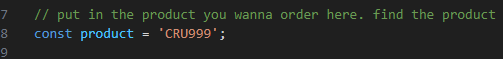
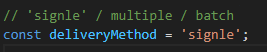
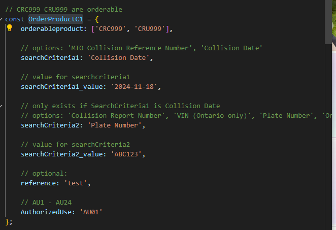
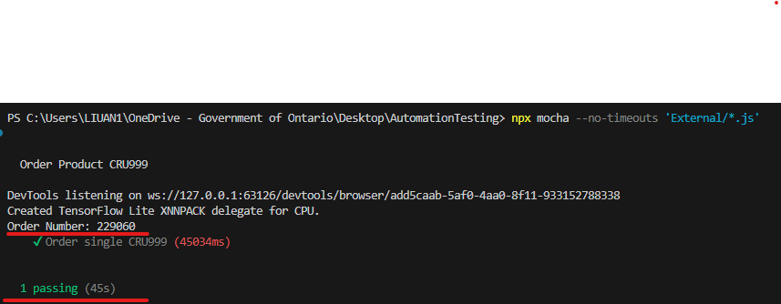

# Automation testing  - Andy Liu

> ## User Part
> - inside "testingConstants.js", user can order product through putting the product code in `const product = 'productName'` and put other Search Criterias into the corresponding object( corressponding object means the object that has this product in the orderable product array). 
> - For example, if you wanna order signle CRU999, you need set `const product = 'CRU999'`, and searchCriterias into `OrderProductC1` since it is inside the orderable array of `OrderProductC1`.
>   - remember to set the criteria to be what you want.

> - run the program: \
> in the terminal, run the command `npx mocha --no-timeouts 'External/*.js'` 
>   - exmaple of ordering product CRU999(using the criterias above): 
>   - if you see the output "Order Number: some_number" and pass reuslt below, then it means the testing is successful.

> ## Automation testing program part
> - so far I only have time to finish order signle CRC999 and CRU999, but when you walk through the code I did, you can apply the same logic and pattern to all other delivery method and products
> - 

